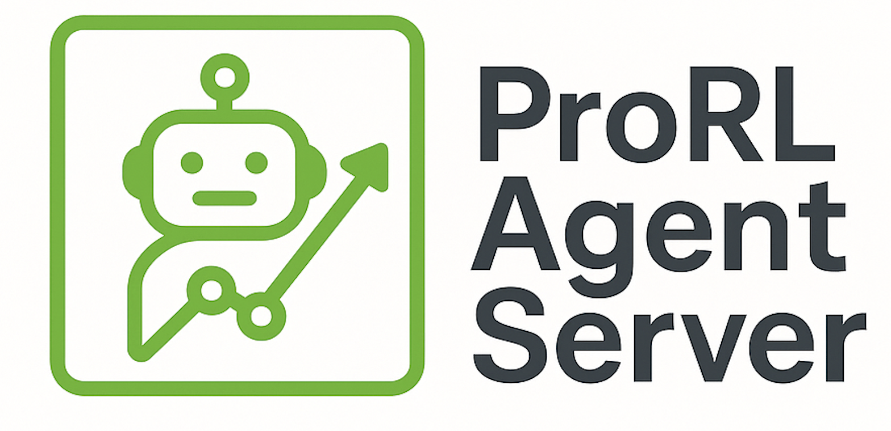
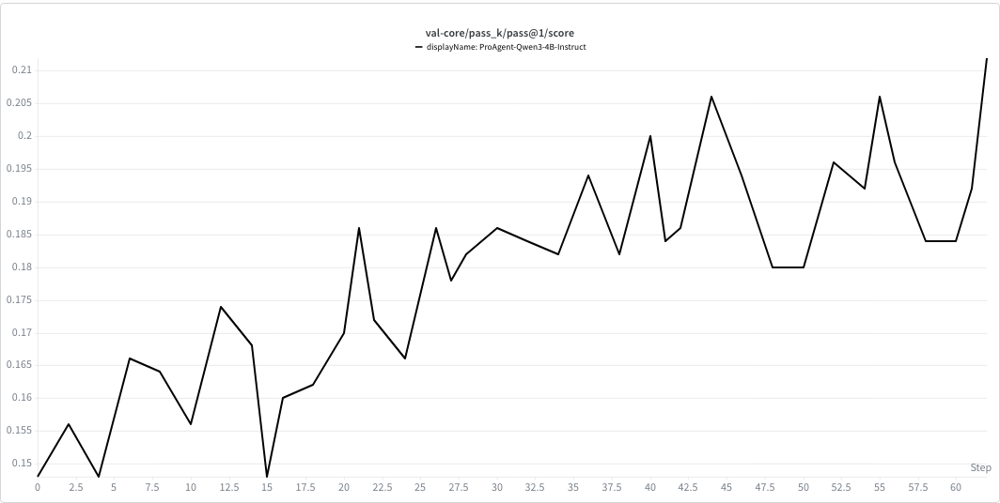

# ProRL Agent Server: Rollout-as-a-Service for Multi-Turn RL Agents

<p align="center"></p>

<p align="center">
<a href="https://codecov.io/gh/NVIDIA-NeMo/ProRL-Agent-Server"></a>
<a href="https://arxiv.org/abs/2603.18815"></a>
<a href="https://www.python.org/downloads/release/python-3120/"></a>
<a href="https://github.com/NVIDIA-NeMo/ProRL-Agent-Server/stargazers/"></a>
</p>

## ☁️ Introduction

ProRL Agent Server is a scalable rollout-as-a-service infrastructure for reinforcement-learning training of multi-turn LLM agents. It addresses a core systems bottleneck in agentic RL: rollout generation is I/O- and tool-execution-heavy, while policy optimization is GPU-heavy, yet many existing systems couple both lifecycles inside the trainer.

ProRL Agent Server separates the full agentic rollout lifecycle from the RL trainer. A trainer submits task instances through HTTP and receives completed trajectories, rewards, and rollout metadata, while the server handles sandbox initialization, multi-turn tool use, LLM backend routing, evaluation, cancellation, and cleanup. The system is built on OpenHands, includes verl integration, is released as part of NVIDIA NeMo Gym, and is designed for rootless HPC deployments with Singularity/Apptainer.

Paper: [ProRL Agent: Rollout-as-a-Service for RL Training of Multi-Turn LLM Agents](https://arxiv.org/abs/2603.18815)

Key capabilities:

- **Rollout-as-a-service:** expose the full rollout lifecycle through HTTP so trainers can remain agnostic to agent execution details.
- **Three-stage async pipeline:** run `INIT -> RUN -> EVAL` through independent worker pools to overlap sandbox setup, agent execution, and reward evaluation.
- **Dynamic LLM backend management:** register, clear, and load-balance vLLM backends during training, including checkpoint swaps without restarting the rollout server.
- **Pluggable `AgentHandler` interface:** customize environment setup, multi-turn agent execution, reward scoring, error handling, and result serialization for new tasks.
- **Token-in/token-out communication:** pass token IDs and log probabilities end to end to avoid re-tokenization drift in multi-turn trajectories.
- **Rootless sandbox runtime:** support `.sif` containers, Slurm integration, and secure multi-user HPC environments through Singularity/Apptainer.
- **Trainer integration:** connect to verl-style RL loops while keeping the rollout service independent of any single training backend.
- **Lifecycle management:** track status, queue jobs, support cancellation, enforce phase-aware timeouts, and clean up resources.
- **Efficient Bash tool:** use a `ptyprocess`-based implementation for up to 6x speedups over the previous tmux-based approach.
- **Efficient IPython tool:** integrate directly with IPython kernels without extra network overhead.
- **UDS communication:** use Unix domain sockets for improved throughput and isolation.

## 💻 Quick Start

1. **Install dependencies**

   This project requires Python 3.12 or 3.13.

   Install the Python dependencies:

   ```bash
   poetry install --with dev,test,runtime,evaluation
   pip install git+https://github.com/SWE-Gym/SWE-Bench-Package.git
   pip install git+https://github.com/R2E-Gym/R2E-Gym.git
   ```

   Install Singularity/Apptainer if your environment does not already provide it:

   ```bash
   sudo apt-get update
   sudo apt-get install -y software-properties-common curl gnupg
   sudo apt-get install -y singularity-container fuse
   sudo add-apt-repository -y ppa:apptainer/ppa
   sudo apt-get update
   sudo apt-get install -y apptainer
   ```

2. **Start a vLLM server**

   Launch vLLM with your Hugging Face model:

   ```bash
   vllm serve path/to/your/model \
     --enable-auto-tool-choice \
     --tool-call-parser hermes \
     --host 127.0.0.1 \
     --port 8000 \
     --api-key key \
     --served-model-name model_name &
   ```

   Replace `path/to/your/model`, `model_name`, host, port, and API key with the values for your setup.

3. **Pull Singularity images for SWE tasks**

   ```bash
   python scripts/pull_swe_images.py \
     --parquet-file /path/to/train.parquet \
     --dest-dir /some/dir \
     --temp-base /some/dir \
     --log-name log
   ```

   Download the parquet data from Hugging Face first. Supported training datasets include:

   - SWE-Gym: https://huggingface.co/datasets/NovaSky-AI/SkyRL-v0-293-data
   - R2E-Gym: https://huggingface.co/R2E-Gym
   - SWE-bench Multimodal: https://huggingface.co/datasets/SWE-bench/SWE-bench_Multimodal
   - SWE-bench: https://huggingface.co/datasets/SWE-bench/SWE-bench
   - SWE-smith: https://huggingface.co/datasets/SWE-bench/SWE-smith

4. **Start the async evaluation server**

   The FastAPI server manages rollouts through the same lifecycle described in the paper: initialization, multi-turn execution, and evaluation. It exposes `/start`, `/process`, `/status`, `/add_llm_server`, `/clear_llm_server`, `/cancel`, and related endpoints. Use `--max-init-workers`, `--max-run-workers`, and `--timeout` to control concurrency and time limits.

   ```bash
   export OH_RUNTIME_SINGULARITY_IMAGE_REPO=/path/to/singularity_images
   python scripts/start_server.py \
     --host 0.0.0.0 \
     --port 8006 \
     --max-init-workers 64 \
     --max-run-workers 64 \
     --timeout 300
   ```

5. **Test the server**

   Before sending jobs to `/process`, register at least one LLM server and start the worker process. The sequence below assumes the vLLM server from step 2 is already running.

   Register the LLM server address. Include `/v1`:

   ```bash
   curl -X POST http://localhost:8006/add_llm_server \
     -H 'Content-Type: application/json' \
     -d '{"address":"http://127.0.0.1:8000/v1"}'
   ```

   Start the worker process:

   ```bash
   curl -X POST http://localhost:8006/start
   ```

   Optionally check server status:

   ```bash
   curl http://localhost:8006/status
   ```

   Notes:

   - You can call `/add_llm_server` before `/start`; the address will be buffered and applied when the worker starts.
   - During training, use `/clear_llm_server` and then re-register backends after loading a new policy checkpoint.
   - Ensure `sampling_params.model` and `api_key` match the model name and key used when launching vLLM.

### Quick Test Script

```bash
python scripts/tests/test_server.py
```

### cURL Example

Send a task to `/process` and read the JSON response.

Input (request body):

- `instance`: the task info (must include `data_source` and any fields your handler needs)
- `sampling_params`: optional LLM/agent settings (e.g., `temperature`, `top_p`, `max_tokens`)
- `job_id` (optional): your own identifier

Example:

```bash
curl -X POST http://localhost:8006/process \
  -H 'Content-Type: application/json' \
  -d '{
    "instance": {
      "data_source": "swebench",
      "instance_id": "python__mypy-16203",
      "trajectory_id": "t0",
      "patch": "",
      "metadata": {}
    },
    "sampling_params": {
      "model": "hosted_vllm/Qwen2.5-7B-Instruct",
      "api_key": "key",
      "modify_params": false,
      "log_completions": true,
      "native_tool_calling": false,
      "temperature": 0.6,
      "top_p": 0.9,
      "token_level_generation": true,
      "custom_tokenizer": "tokenizer_path",
      "max_iterations": 5
    }
  }'
```

Output (response body):

```json
{
  "resolved": true,
  "report": {"pass@1": 0.0, "details": {"...": "..."}},
  "timing": {"init": 2.1, "run": 41.3, "eval": 5.2, "others": 1.4, "timeout": 300.0}
}
```

## 💻 RL Training with verl

1. Clone [verl](https://github.com/verl-project/verl) and check out the supported commit:

   ```bash
   cd /path/to/verl
   git checkout 60138ebd
   ```

2. Install verl by following the upstream [verl installation guide](https://github.com/verl-project/verl).

3. Install the ProRL Agent Server verl integration:

   ```bash
   cd ProRL-Agent-Server/trainer_integration/verl
   pip install -e .
   ```

4. Start the agent server:

   ```bash
   export OH_RUNTIME_SINGULARITY_IMAGE_REPO=/path/to/singularity_images
   python scripts/start_server.py \
     --host 0.0.0.0 \
     --port 8006 \
     --max-init-workers 64 \
     --max-run-workers 64 \
     --timeout 1000
   ```

5. Run the training script:

   ```bash
   bash trainer_integration/verl/verl_custom/nvidia/scripts/run_proagent_qwn3_4B_instruct.sh
   ```

## 💻 Add a New Task/Handler

To add a new task:

- Implement an `AgentHandler` with `name`, `init(job_details, ...)`, `run(job_details, ...)`, and `eval(job_details, ...)`.
- Register it in the registry so that `instance["data_source"] == name` routes requests to your handler.
- Provide `final_result(job_details)` for result shaping.
- Return a consistent result schema and handle timeouts and errors.

Minimal sketch:

```python
from openhands.nvidia.registry import AgentHandler, register_agent_handler

class MyTaskHandler(AgentHandler):
    @property
    def name(self) -> str: return "my_task"
    async def init(self, job_details, sid=None, **kwargs):
        return runtime, metadata, config
    async def run(self, job_details, sid=None, **kwargs):
        return {"git_patch": "...", "messages": []}
    async def eval(self, job_details, sid=None, allow_skip=True, reward=None):
        return {"report": {"resolved": True}}

register_agent_handler(MyTaskHandler())
```

Then submit requests with `{"data_source": "my_task", ...}` in `instance`.

## 💻 Run Unit Tests

Example:

```bash
TEST_RUNTIME=singularity RUN_AS_OPENHANDS=False PYTHONPATH='.' pytest tests/runtime/test_browsing.py -v -s
```

## ⚙️ Environment Variables

### Image Storage Location

`OH_RUNTIME_SINGULARITY_IMAGE_REPO` specifies where Singularity runtime images are stored.

```bash
export OH_RUNTIME_SINGULARITY_IMAGE_REPO=/path/to/singularity_images
```

## 📄 Documentation

More module READMEs (click to open):

- [`openhands/README.md`](openhands/README.md)
- [`openhands/nvidia/README.md`](openhands/nvidia/README.md)
- [`openhands/llm/nvidia/README.md`](openhands/llm/nvidia/README.md)
- [`scripts/README.md`](scripts/README.md)
- [`tests/nvidia/README.md`](tests/nvidia/README.md)

## 💡 Current Results

The paper evaluates ProRL Agent Server through end-to-end RL training across software engineering, STEM, math, and coding agents. For SWE tasks, we train on the 293-instance SWE-Gym subset used by [SkyRL-v0-293-data](https://huggingface.co/datasets/NovaSky-AI/SkyRL-v0-293-data). Training is performed with DAPO on 32 NVIDIA H100 GPUs unless otherwise specified.

SWE-Bench Verified results:

| Model scale | Base model | Pass@1 | ProRL Agent RL | Pass@1 |
| --- | --- | ---: | --- | ---: |
| 4B | Qwen3-4B-Instruct-2507 | 14.8 | ProRL Agent-4B | 21.2 |
| 8B | Qwen3-8B | 9.6 | ProRL Agent-8B | 18.0 |
| 14B | Qwen3-14B | 15.4 | ProRL Agent-14B | 23.6 |

Beyond SWE, the same rollout infrastructure supports other agentic domains by changing handlers, tools, and rewards: STEM agents use web search plus Bash/IPython tools, math agents use IPython-backed computation and planning tools, and code agents use file editing plus test-driven verification.



## 📖 Citation

> [!IMPORTANT]
> If you find it useful, please read and cite our paper: https://arxiv.org/abs/2603.18815

```md
@article{zhang2026prorl,
  title={ProRL Agent: Rollout-as-a-Service for RL Training of Multi-Turn LLM Agents},
  author={Zhang, Hao and Liu, Mingjie and Zhang, Shaokun and Han, Songyang and Hu, Jian and Jin, Zhenghui and Zhang, Yuchi and Diao, Shizhe and Lu, Ximing and Xu, Binfeng and others},
  journal={arXiv preprint arXiv:2603.18815},
  year={2026}
}
```
