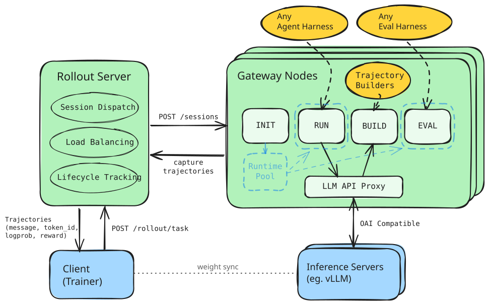
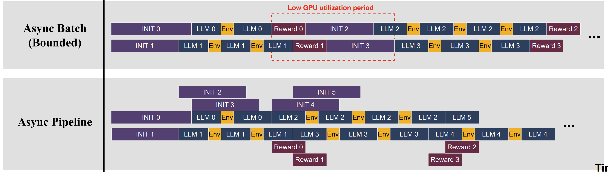

# Agent Rollout Server

An ultra-flexible rollout protocol for running **full async** agent RL
on **ANY** agent harness.  It sits between your agent harness (Claude Code, OpenCode, Codex, OpenHands ...)
and your model, transparently listening to LLM calls and reconstruct completions into trainable agent trajectories and rewards.

<p align="center">
  
</p>


---

## Core Features

### Rollout as a Service

Submit a single task request and the rollout server handles the rest — dispatching *N* parallel sessions across a pool of gateway nodes, load-balancing, health tracking and collecting async trajectories through gateway node callbacks.

### Framework Agnostic Agent Rollout

With the unique proxy-rerouting design, ARP can be used to rollout **ANY** agent harness and environments by subscribing to internal requests.
Register your own agent harnesses as a shell command or reuse our integrated ones.

### Async Staging

Inspired by [ProRL Agent Server](https://github.com/NVIDIA-NeMo/ProRL-Agent-Server) and SkyRL, `INIT` submits prepared runtimes to `READY` buffer for async `RUN` collection, sending time-consuming CPU-bound docker / apptainer initializations to the background, and maximizing system GPU utilization.

<p align="center">
  
</p>

### Flexible Trajectory Construction

Completion records are assembled into structured traces via extensible builders:

| Builder | Behavior |
|---------|----------|
| `all_records` | One trace per completion — simple and lossless |
| `prefix_merging` | Merges consecutive completions into longer multi-turn traces when each prompt is exactly the prior prompt + response; splits on context compaction |

---

## Installation

```bash
uv pip install -e .              # core gateway + rollout server
uv pip install -e ".[slime]"     # include Slime trainer bridge
```

Install and run SGLang separately (see the [SGLang docs](https://docs.sglang.ai/)).

## Quick Start

See [examples/calculator/README.md](examples/calculator/README.md) for a minimal example to run with single machine with 2 x (>24G) GPUs.

## CLI

```bash
polar serve_rollout -c topology.yaml
polar serve_gateway -c topology.yaml --node-id node-a
polar submit task.json -c topology.yaml
polar status -c topology.yaml
```

`polar submit` accepts JSON and YAML task files. `polar status` shows rollout health, registered nodes, queue pressure, and task states.

## Example Topology File

```yaml
rollout:
  host: 127.0.0.1
  port: 8080
  public_url: http://127.0.0.1:8080
  save_dir: ./rollout_results

gateway:
  heartbeat_interval_seconds: 30
  nodes:
    - id: localhost-node-01
      host: 127.0.0.1
      port: 8100
      public_url: http://127.0.0.1:8100
      model_served: Qwen/Qwen3.5-4B
      max_init_workers: 8
      max_run_workers: 4
      max_postrun_workers: 4
      ready_buffer_target: 4
      sglang:
        base_url: http://127.0.0.1:8000
        timeout: 300
```

## Example Task Shape

```json
{
  "task_id": "example-task-001",
  "instruction": "Write a calculator and save it as calculator.py",
  "num_samples": 8,
  "timeout_seconds": 900,
  "runtime": {
    "backend": "docker",
    "image": "polar-localhost-codex:latest",
    "workdir": "/polar/session/workspace",
    "network": "host"
  },
  "agent": {
    "harness": "codex",
    "model_name": "openai/gpt-5.4"
  },
  "builder": {"strategy": "prefix_merging"}
}
```
