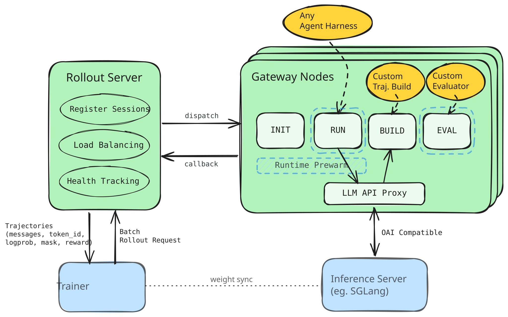
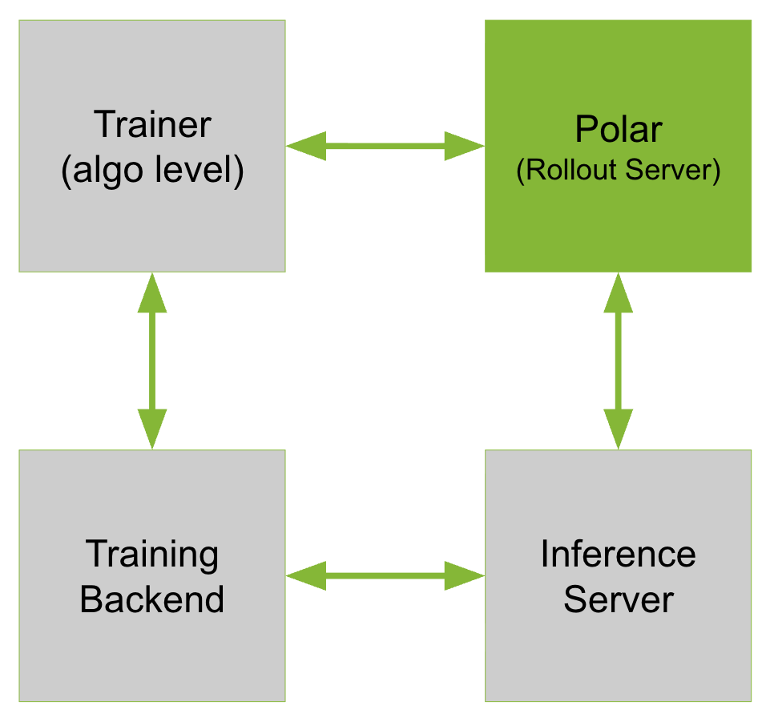

# ProRL Agent Server (POLAR)

**Polar** is a lightweight RL rollout framework targeting real-world aegnt harnesses. 

<p align="center">
  
</p>


It features:

1. **Any Harness as Environment.** Trajectories are captured via API proxy, reconstruced and evaluated into token-faithful samples. Register your custom logic without friction.
2. **Efficient Rollout Pipeline.** Maximizing GPU utilization by async staging and runtime prewarm.
3. **Rollout as a Service.** Server mode by design -- for easy integration with training frameworks, Async RL and scaling.


## Architecture Overview
<p align="center">
  
</p>

*The Rollout Server manages and dispatches client requests into distributed Gateway Nodes, which asynchronously prepare runtime, execute agents, build trajectories and evaluate them. Agent harnesses are listened by a proxy that sits between agnostic agent execution processes and local inference servers.*


## Installation

```bash
uv venv
uv pip install -e .
```

SGLang is installed and launched separately.

```bash
uv pip install --prerelease=allow sglang==0.5.10
bash scripts/patch/patch_sglang.sh
```

For SWE-bench evaluation support:

```bash
uv pip install -e ".[swebench]"
```

**Polar** itself is trainer agnostic. Currently, we provide a demo-purpose [Slime](https://github.com/THUDM/slime) integration in [Slime bridge installation guide](src/slime_bridge/README.md#slime-installation).


## Developer Guide

- [Customize agent harnesses](src/polar/agent/README.md): choose a built-in harness, or use the shell harness for wrapped agent execution command.
- [Customize trajectory build and evaluation](src/polar/trajectory/README.md):
  choose or register builders and evaluators. See [builder](src/polar/trajectory/builder/README.md) and
  [evaluator](src/polar/trajectory/evaluator/README.md) guides for built-in strategies.
- [Topology configuration](src/polar/config/README.md): define
  rollout and gateway nodes, networking, worker limits, and model endpoints.
- [Rollout request configuration](src/polar/rollout/README.md): trainer / client side task submission.


## Examples

- [Calculator](examples/calculator/README.md): minimal smoke test without extra runtime dependency.
- [SWE-bench Verified](examples/swebench_verified/README.md): benchmark-style
  evaluation on SWE-bench Verified tasks.
- [SWE-Gym Slime GRPO](examples/swegym_slime_grpo/README.md): training
  path that connects Polar rollouts to Slime.

This project is under early development. We are actively adding new examples for different tasks / models on diverse hardware setups. **Contributions are welcome!**


## Roadmap

<table>
<tr>
<td width="65%" valign="top">

Our development goal for **Polar** is to stay low-intrusion and neutral, finding the lowest common ancestor to cover and support diverse training and inference frameworks.

- [x] Initial release & tech report.
- [x] Slime bridge & RL example.
- [ ] vLLM dual inference support.
- [ ] More trainer bridge examples.
- [ ] CUA (VLM / VLA) (OSWorld) Support.

</td>
<td width="35%" align="center" valign="middle">
  
</td>
</tr>
</table>


