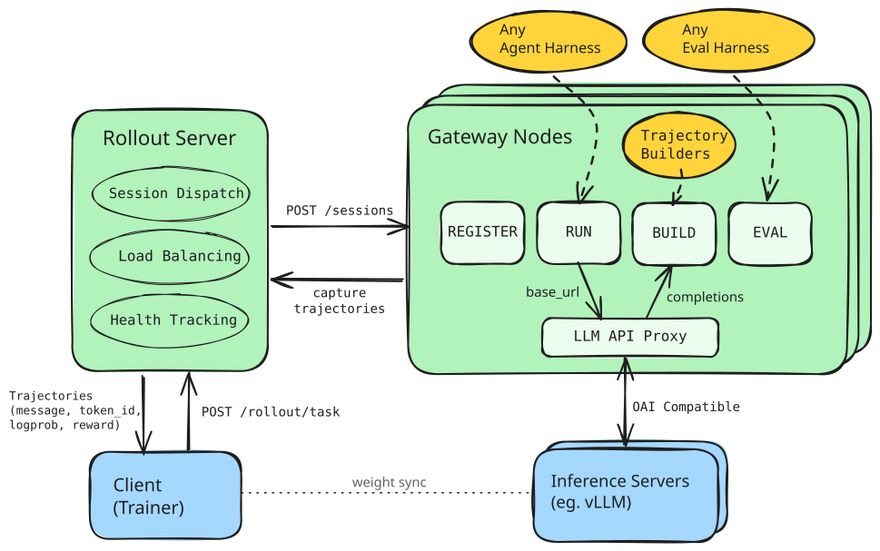

# ProRL Agent Rollout Protocol

A lightweight and ultra-flexible protocol for running **massively parallel LLM agent rollouts**
against one or more `vLLM` backends. Each gateway node proxies one upstream
`vLLM` server, while the rollout server balances work across a pool of gateway
nodes. It sits between your agent harness (Claude Code, OpenCode, Codex, ...)
and your model, transparently proxying any supported API format while capturing
every completion for trajectory construction and reward assignment.

<p align="center">
  
</p>


---

## Core Features

### Rollout as a Service

Submit a single task request and the rollout server handles the rest — dispatching *N* parallel sessions across a pool of gateway nodes, load-balancing with least-loaded scheduling, collecting results via callbacks (with polling fallback), returning trajectories in the task response, and optionally persisting rollouts to disk.

### Agnostic Agent & Eval Harness

Agent and eval harnesses are **plain shell commands**. The gateway injects the right environment variables (`ANTHROPIC_BASE_URL`, `OPENAI_BASE_URL`, `GOOGLE_API_URL`, API keys, session IDs) so any CLI that speaks a supported API just works. Eval scripts receive the trajectory path and can write back rewards — no SDK required.

### Advanced Trajectory Construction

Completion records are assembled into structured traces via pluggable builders:

| Builder | Behavior |
|---------|----------|
| `all_records` | One trace per completion — simple and lossless |
| `prefix_merging` | Merges consecutive completions into longer multi-turn traces when each prompt is exactly the prior prompt + response; splits on context shifts (compaction, summarization) |

Custom builders are supported through a plugin registry (`module:ClassName`).

---

## Installation

Requires **Python >= 3.10**.

```bash
uv venv .venv && . .venv/bin/activate
uv pip install -e .
```

---

## Quick Start

See [**examples/localhost_multi_node/**](examples/localhost_multi_node/) for a
localhost topology with one rollout server, four gateway nodes, and two
`vLLM` servers. This is the supported multi-`vLLM` pattern in the current
codebase: multiple gateway nodes, each configured with its own served model and
upstream `vLLM` base URL.

---

## Supported Proxies

### Agent Harnesses

Any CLI that calls an LLM API can be used as an agent harness. Tested with:

| Harness | API Wire Format | Key Env Vars |
|---------|----------------|--------------|
| **Claude Code** | Anthropic Messages | `ANTHROPIC_BASE_URL`, `ANTHROPIC_API_KEY` |
| **OpenCode** | OpenAI Chat | `OPENAI_BASE_URL`, `OPENAI_API_KEY` |
| **Codex CLI** | OpenAI Responses | `OPENAI_BASE_URL`, `OPENAI_API_KEY` |
| *Google clients* | Generative AI | `GOOGLE_API_URL`, `GOOGLE_API_KEY` |

### API Types

The gateway auto-detects the incoming format and transforms it to OpenAI Chat for vLLM:

| API Type | Detection | Transformer |
|----------|-----------|-------------|
| `anthropic` | `/v1/messages`, `anthropic-version` header | Anthropic Messages ↔ OpenAI Chat |
| `openai_chat` | `/v1/chat/completions` | Passthrough |
| `openai_responses` | `/v1/responses` | OpenAI Responses ↔ OpenAI Chat |
| `google` | `generateContent` in path | Google Generative AI ↔ OpenAI Chat |
