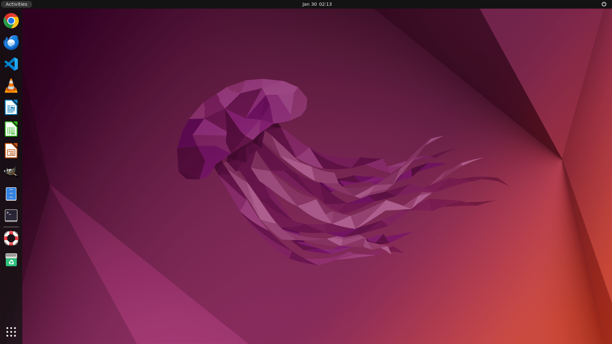

# OSWorld Linux Docker Environment

This Docker image replicates the OSWorld Linux environment (Ubuntu 22.04 with GNOME Shell desktop) for benchmark tasks. It includes all required applications and configurations to match the original OSWorld QEMU VM exactly.

## Screenshot



*Ubuntu 22.04 with GNOME Shell desktop environment - matching the original OSWorld QEMU VM*

## Features

- **Base OS**: Ubuntu 22.04 LTS with GNOME Shell 42.9 (same as original OSWorld VM)
- **Display**: 1920x1080 resolution via Xvfb (headless)
- **VNC Access**: x11vnc + noVNC for remote desktop access
- **OSWorld Server**: Flask-based API server for automation
- **Caddy Reverse Proxy**: Unified access to all services on port 8000
- **Systemd Init**: Full systemd support for GNOME Shell compatibility

### Available Images

| Image | Dockerfile | Description |
|-------|------------|-------------|
| `osworld-linux` | `Dockerfile` | GNOME Shell (English UI) - matches original OSWorld VM |
| `osworld-linux-zh` | `Dockerfile.chinese` | Simplified Chinese UI (简体中文) |
| `osworld-linux-unity` | `Dockerfile.unity` | Legacy Unity desktop (not recommended) |

### Installed Applications

| Application | Version | Purpose |
|-------------|---------|---------|
| Google Chrome | Latest stable | Web browser tasks (46 benchmark tasks) |
| LibreOffice | 7.x | Office suite tasks |
| GIMP | 2.10.x | Image editing tasks (26 benchmark tasks) |
| VLC Media Player | 3.0.x | Media playback tasks (17 benchmark tasks) |
| Visual Studio Code | Latest | Code editing tasks (23 benchmark tasks) |
| Thunderbird | Latest | Email client tasks (15 benchmark tasks) |

### LibreOffice Components
- LibreOffice Writer - Document processing (23 benchmark tasks)
- LibreOffice Calc - Spreadsheet operations (47 benchmark tasks)
- LibreOffice Impress - Presentation editing (47 benchmark tasks)

## Quick Start

### Build the Image

```bash
cd osworld-docker

# Build the GNOME Shell image (recommended - matches original OSWorld VM)
docker build -t osworld-linux .

# Chinese version (coming soon)
docker build -t osworld-linux-zh -f Dockerfile.chinese .
```

### Run with Docker

The GNOME Shell image requires systemd, which needs additional Docker flags:

```bash
docker run -d \
  --name osworld \
  --privileged \
  --cgroupns=host \
  -v /sys/fs/cgroup:/sys/fs/cgroup:rw \
  --shm-size=2g \
  -p 8000:8000 \
  -p 9222:9222 \
  osworld-linux
```

### Run with Docker Compose (Recommended)

```bash
docker-compose up -d
```

## Accessing the Environment

All services are accessible through the Caddy reverse proxy on port 8000:

### Web-based VNC (noVNC)
Open your browser and navigate to:
```
http://localhost:8000/vnc.html
```
Or simply:
```
http://localhost:8000
```

### OSWorld API Server
The REST API server is available at:
```
http://localhost:8000/api/
```

Endpoints:
- `GET /api/screenshot` - Get current desktop screenshot (PNG)
- `POST /api/execute` - Execute a command
- `POST /api/setup` - Setup configuration
- `GET /api/info` - Get system information
- `GET /api/accessibility_tree` - Get accessibility tree

### Chrome DevTools Protocol
Chrome is configured with remote debugging enabled:
```
http://localhost:8000/chrome/json
```
Or directly on port 9222:
```
http://localhost:9222
```

### VLC HTTP Interface
```
http://localhost:8000/vlc/
```

## Architecture

```
┌─────────────────────────────────────────────────────────────┐
│                     Docker Container                         │
│                        (systemd)                             │
│  ┌─────────────────────────────────────────────────────┐    │
│  │                    Caddy :8000                       │    │
│  │  ┌─────────┬────────┬────────┬─────────┬─────────┐  │    │
│  │  │ /vnc/*  │ /api/* │/chrome/│  /vlc/* │    /    │  │    │
│  │  └────┬────┴───┬────┴───┬────┴────┬────┴────┬────┘  │    │
│  └───────┼────────┼────────┼─────────┼─────────┼───────┘    │
│          │        │        │         │         │            │
│          ▼        ▼        ▼         ▼         ▼            │
│      ┌──────┐ ┌──────┐ ┌──────┐ ┌───────┐ ┌────────┐       │
│      │noVNC │ │Server│ │Chrome│ │  VLC  │ │Redirect│       │
│      │:5910 │ │:5000 │ │:9222 │ │ :8100 │ │→noVNC  │       │
│      └──────┘ └──────┘ └──────┘ └───────┘ └────────┘       │
│          │                                                  │
│          ▼                                                  │
│      ┌──────────────────────────────────────────────┐      │
│      │              GNOME Shell Desktop             │      │
│      │                   (mutter)                   │      │
│      │  ┌──────┐ ┌──────┐ ┌──────┐ ┌──────────┐   │      │
│      │  │Chrome│ │ VLC  │ │ GIMP │ │LibreOffice│   │      │
│      │  └──────┘ └──────┘ └──────┘ └──────────┘   │      │
│      └──────────────────────────────────────────────┘      │
│                          │                                  │
│                          ▼                                  │
│      ┌──────────────────────────────────────────────┐      │
│      │              Xvfb :0 (1920x1080)             │      │
│      └──────────────────────────────────────────────┘      │
└─────────────────────────────────────────────────────────────┘
```

## Why GNOME Shell Instead of Unity?

The original OSWorld QEMU VM runs Ubuntu 22.04 with **GNOME Shell 42.9**, not Unity. This Docker image now uses the same desktop environment to ensure:

1. **Identical UI behavior** - Same dock, animations, and click responsiveness
2. **Same application integration** - Ubuntu Dock extension matches the original
3. **Better compatibility** - GNOME Shell is the standard Ubuntu 22.04 desktop

## Systemd Requirement

GNOME Shell requires systemd's logind service for session management. The Docker container runs systemd as PID 1, which requires:

- `--privileged` flag
- `--cgroupns=host` for cgroup namespace
- `-v /sys/fs/cgroup:/sys/fs/cgroup:rw` for cgroup filesystem access

## Troubleshooting

### Container not starting
Ensure you're using the correct Docker run flags with systemd requirements.

### Black screen in VNC
Wait a few seconds for GNOME Shell to fully initialize. Check logs with:
```bash
docker logs osworld
```

### Services not running
Check systemd service status:
```bash
docker exec osworld systemctl status gnome-session xvfb x11vnc novnc osworld caddy
```

## Comparison with Original OSWorld VM

| Feature | Original QEMU VM | Docker Container |
|---------|------------------|------------------|
| Base OS | Ubuntu 22.04.3 LTS | Ubuntu 22.04 LTS |
| Desktop | GNOME Shell 42.9 | GNOME Shell 42.9 |
| Display Manager | GDM3 | systemd service |
| Init System | systemd | systemd |
| Hardware | QEMU/KVM | Docker/containerd |

## License

This project is for research and educational purposes.
