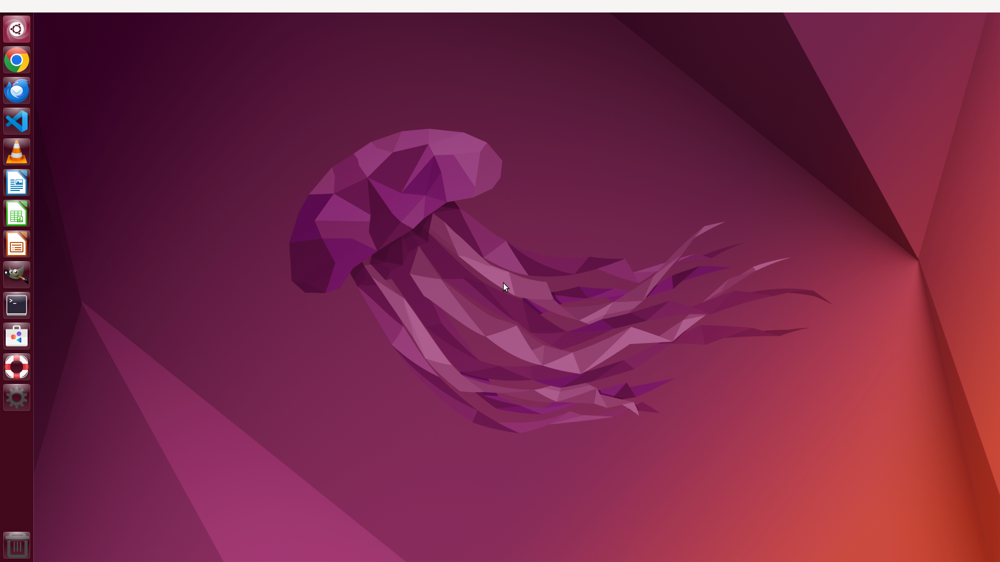

# OSWorld Linux Docker Environment

This Docker image replicates the OSWorld Linux environment (Ubuntu 22.04 with Unity desktop) for benchmark tasks. It includes all required applications and configurations as specified in the OSWorld setup documentation.

## Screenshot



*Ubuntu 22.04 with Unity desktop environment - matching the OSWorld QEMU VM appearance*

## Features

- **Base OS**: Ubuntu 22.04 LTS with Unity desktop environment
- **Display**: 1920x1080 resolution via Xvfb (headless)
- **VNC Access**: x11vnc + noVNC for remote desktop access
- **OSWorld Server**: Flask-based API server for automation
- **Caddy Reverse Proxy**: Unified access to all services on port 8000

### Available Images

| Image | Dockerfile | Description |
|-------|------------|-------------|
| `osworld-linux` | `Dockerfile` | English UI (default) |
| `osworld-linux-zh` | `Dockerfile.chinese` | Simplified Chinese UI (简体中文) |

### Installed Applications

| Application | Version | Purpose |
|-------------|---------|---------|
| Google Chrome | Latest stable | Web browser tasks (46 benchmark tasks) |
| LibreOffice | 7.3.7.2 | Office suite tasks |
| GIMP | 2.10.x | Image editing tasks (26 benchmark tasks) |
| VLC Media Player | 3.0.x | Media playback tasks (17 benchmark tasks) |
| Visual Studio Code | Latest | Code editing tasks (23 benchmark tasks) |
| Thunderbird | Latest | Email client tasks (15 benchmark tasks) |

### LibreOffice Components
- LibreOffice Writer - Document processing (23 benchmark tasks)
- LibreOffice Calc - Spreadsheet operations (47 benchmark tasks)
- LibreOffice Impress - Presentation editing (47 benchmark tasks)

## Quick Start

### Build the Image

```bash
cd osworld-docker

# English version
docker build -t osworld-linux .

# Chinese version
docker build -t osworld-linux-zh -f Dockerfile.chinese .
```

### Run with Docker Compose (Recommended)

```bash
docker-compose up -d
```

### Run with Docker

```bash
docker run -d \
  --name osworld \
  --privileged \
  --shm-size=2g \
  -p 8000:8000 \
  -p 9222:9222 \
  osworld-linux
```

For the Chinese version:
```bash
docker run -d \
  --name osworld-zh \
  --privileged \
  --shm-size=2g \
  -p 8000:8000 \
  -p 9222:9222 \
  osworld-linux-zh
```

## Accessing the Environment

All services are accessible through the Caddy reverse proxy on port 8000:

### Web-based VNC (noVNC)
Open your browser and navigate to:
```
http://localhost:8000/vnc.html
```
Or simply:
```
http://localhost:8000
```

### OSWorld API Server
The REST API server is available at:
```
http://localhost:8000/api/
```

### VLC HTTP Interface
```
http://localhost:8000/vlc/
```

### Chrome DevTools Protocol (CDP)
```
http://localhost:8000/chrome/json
```
Or directly via port 9222:
```
http://localhost:9222/json
```

## Port Configuration

### Caddy Proxy (Primary Access)

| Path | Internal Service | Description |
|------|------------------|-------------|
| `/` or `/vnc.html` | noVNC (5910) | Web-based VNC access |
| `/api/*` | OSWorld Server (5000) | Main API server |
| `/vlc/*` | VLC HTTP (8100) | VLC media player control |
| `/chrome/*` | Chrome CDP (9222) | Chrome DevTools Protocol |
| `/websockify` | websockify (5910) | VNC WebSocket connection |

### Exposed Ports

| Port | Service | Description |
|------|---------|-------------|
| 8000 | Caddy | Reverse proxy (primary access point) |
| 9222 | Chrome DevTools | Chrome remote debugging (direct access) |

### Internal Ports (not exposed by default)

| Port | Service | Description |
|------|---------|-------------|
| 5000 | OSWorld Server | Main API server (Flask) |
| 5900 | x11vnc | VNC server |
| 5910 | noVNC/websockify | Web-based VNC |
| 8100 | VLC HTTP | VLC media player control |

## API Endpoints

### Server Status
```bash
curl http://localhost:8000/api/version
```

### Screenshot
```bash
curl http://localhost:8000/api/screenshot --output screenshot.png
```

### Execute Command
```bash
curl -X POST http://localhost:8000/api/execute \
  -H "Content-Type: application/json" \
  -d '{"command": "ls -la", "shell": true}'
```

### Get Accessibility Tree
```bash
curl http://localhost:8000/api/accessibility
```

### Launch Application
```bash
curl -X POST http://localhost:8000/api/setup/launch \
  -H "Content-Type: application/json" \
  -d '{"command": ["google-chrome", "--no-sandbox"]}'
```

## Verification

Run the verification script to ensure all components are working:

```bash
chmod +x verify.sh
./verify.sh
```

Or run inside the container:
```bash
docker exec osworld /usr/local/bin/verify-apps.sh
```

## Credentials

- **Username**: `user`
- **Password**: `password`

## Configuration Details

### Unity Desktop
- Unity launcher with pre-configured application shortcuts
- Compiz window manager with Unity shell plugin
- Ubuntu Jammy Jellyfish wallpaper

### Chrome Configuration
- Remote debugging enabled (internal port 9223, forwarded to 0.0.0.0:9222 via socat)
- `--no-sandbox` flag required for Docker containers
- Password manager disabled
- Autofill disabled
- Sync disabled

### VLC Configuration
- HTTP interface enabled
- HTTP password: `password`
- HTTP port: 8100 (internal), accessible via `/vlc/` path on port 8000

### VS Code Configuration
- Workspace trust disabled
- Telemetry disabled

### LibreOffice Configuration
- Default save formats set to Microsoft Office formats (.docx, .xlsx, .pptx)

### Thunderbird Configuration
- Accessibility tree enabled via: `gsettings set org.gnome.desktop.interface toolkit-accessibility true`

## Chinese Version (Dockerfile.chinese)

The Chinese version includes:

- **System locale**: Simplified Chinese (zh_CN.UTF-8)
- **Timezone**: Asia/Shanghai
- **Chinese fonts**: Noto Sans CJK, WenQuanYi fonts
- **Chinese user directories**: 桌面, 文档, 下载, 图片, 视频, 音乐

### Chinese UI Status

| Application | Chinese UI |
|-------------|------------|
| Ubuntu/Unity Desktop | ✅ Chinese |
| LibreOffice | ✅ Chinese |
| Google Chrome | ✅ Chinese |
| GIMP | ✅ Chinese |
| VS Code | ✅ Chinese (extension auto-installed) |
| Thunderbird | ✅ Chinese |
| VLC | ⚠️ English (known locale issues in Docker) |

## Comparison with QEMU-based OSWorld

This Docker image provides a similar environment to the QEMU-based OSWorld but with some differences:

| Feature | Docker | QEMU |
|---------|--------|------|
| Desktop Environment | Unity | Unity |
| Startup time | Fast (~40s) | Slower (~60s) |
| Resource usage | Lower | Higher |
| Nested virtualization | Not required | Required (KVM) |
| Snapshot support | Via Docker commits | Native QEMU snapshots |
| Network isolation | Docker networking | QEMU user networking |

## Troubleshooting

### VNC not connecting
```bash
# Check if Xvfb is running
docker exec osworld pgrep Xvfb

# Check if x11vnc is running
docker exec osworld pgrep x11vnc

# Restart services
docker exec osworld /usr/local/bin/entrypoint.sh
```

### Unity launcher not showing
```bash
# Restart compiz to reload Unity shell
docker exec -u user osworld bash -c "export DISPLAY=:0 && export DBUS_SESSION_BUS_ADDRESS=unix:path=/run/user/1000/bus && pkill compiz; sleep 2; compiz --replace ccp &"
```

### OSWorld server not responding
```bash
# Check server logs
docker exec osworld cat /home/user/server/server.log

# Restart server
docker exec osworld pkill -f "python3 main.py"
docker exec osworld su - user -c "cd /home/user/server && python3 main.py &"
```

### Applications not launching
```bash
# Check DISPLAY variable
docker exec osworld echo $DISPLAY

# Test X server
docker exec -u user osworld xdotool getmouselocation
```

### Chrome debug port not accessible
```bash
# Check if socat is forwarding the port
docker exec osworld pgrep socat

# Test Chrome CDP directly
curl http://localhost:9222/json
```

## License

This Docker configuration is provided as-is for OSWorld benchmark purposes.
